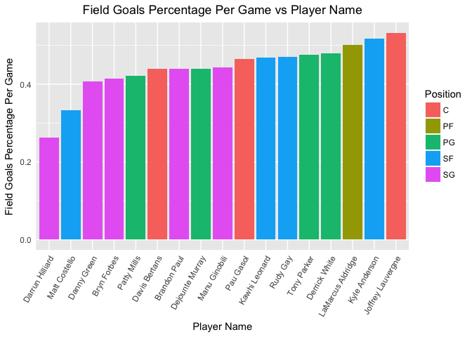

```r
library(rvest)
library(tidyr)
library(ggplot2)
library(kableExtra)
```

## Question 1: Harry Potter Cast

a. Navigate to http://www.imdb.com/title/tt1201607/fullcredits?ref_=tt_ql_1
b. Scrape the page with any R package that makes things easy for you. Of particular interest is the table of the Cast in order of crediting. Please scrape this table (you might have to fish it out of several of the tables from the page) and make it a data.frame() of the Cast in your R environment


```r
url <- 'http://www.imdb.com/title/tt1201607/fullcredits?ref_=tt_ql_1'
page <- read_html(url)

# Idetifying html nodes and putting cast list into table using rvest::html_table
castTable <- rvest::html_nodes(page, css = 'table.cast_list')
castList <- rvest::html_table(castTable)
castList <- data.frame(castList)
```

c. Clean the data set

* Clean out the empty rows and columns
* Assign variable names
* Adjust Mr. Warwick to just “Griphook / Professor Filius Flitwick”
* Remove observation -- 'Rest of cast listed alphabetically'


```r
# Delete the first row, it has no data
castList <- castList[-1,]

# Delete the meaningless columns (Col1 is empty and Col2 has ... in every row)
castList <-castList[,-c(1,3)]

# Apply meaningful column names
names(castList) <- c("Actor/Actress", "Character")

# Fix the row index
rownames(castList) <- 1:nrow(castList)

# Identify rows containing Actor/Actress = Warick Davis
warwick <- grep('[Ww]arwick' ,castList$`Actor/Actress`, value = FALSE)
warwick
```

```
## [1] 10
```

```r
# Change the character name for Warick Davis
warickCharacter <- gsub(castList[warwick,2], 'Griphook / Professor Filius Flitwick',castList[warwick,2])

# Find row containing 'Rest of cast listed alphabetically' and remove it
rest <- grep('[Rr]est of' ,castList$`Actor/Actress`, value = FALSE)
rest
```

```
## [1] 92
```

```r
castList <- castList[-rest,]
rownames(castList) <- 1:nrow(castList) # Adjust rownames to account for deleted row
```

d. Split the Actor’s name into two columns: FirstName and Surname. Keep in mind that some actors/actresses have middle names as well. Please make sure that the middle names are in the FirstName column, in addition to the first name (example: given the Actor Frank Jeffrey Stevenson, the FirstName column would say “Frank Jeffrey.”)


```r
finalCastList <- castList %>%
        tidyr::separate(`Actor/Actress`, into=c('First Name', 'Surname'), sep='[ ](?=[^ ]+$)') # separate by the last space

top10 <- head(finalCastList,10)
knitr::kable(top10,caption = "Top 10 Actor/Actress and Characters", "html") %>%
  kable_styling(bootstrap_options = c("striped","hover"), full_width = F)
```

<table class="table table-striped table-hover" style="width: auto !important; margin-left: auto; margin-right: auto;">
<caption>Top 10 Actor/Actress and Characters</caption>
 <thead>
  <tr>
   <th style="text-align:left;"> First Name </th>
   <th style="text-align:left;"> Surname </th>
   <th style="text-align:left;"> Character </th>
  </tr>
 </thead>
<tbody>
  <tr>
   <td style="text-align:left;"> Ralph </td>
   <td style="text-align:left;"> Fiennes </td>
   <td style="text-align:left;"> Lord Voldemort </td>
  </tr>
  <tr>
   <td style="text-align:left;"> Michael </td>
   <td style="text-align:left;"> Gambon </td>
   <td style="text-align:left;"> Professor Albus Dumbledore </td>
  </tr>
  <tr>
   <td style="text-align:left;"> Alan </td>
   <td style="text-align:left;"> Rickman </td>
   <td style="text-align:left;"> Professor Severus Snape </td>
  </tr>
  <tr>
   <td style="text-align:left;"> Daniel </td>
   <td style="text-align:left;"> Radcliffe </td>
   <td style="text-align:left;"> Harry Potter </td>
  </tr>
  <tr>
   <td style="text-align:left;"> Rupert </td>
   <td style="text-align:left;"> Grint </td>
   <td style="text-align:left;"> Ron Weasley </td>
  </tr>
  <tr>
   <td style="text-align:left;"> Emma </td>
   <td style="text-align:left;"> Watson </td>
   <td style="text-align:left;"> Hermione Granger </td>
  </tr>
  <tr>
   <td style="text-align:left;"> Evanna </td>
   <td style="text-align:left;"> Lynch </td>
   <td style="text-align:left;"> Luna Lovegood </td>
  </tr>
  <tr>
   <td style="text-align:left;"> Domhnall </td>
   <td style="text-align:left;"> Gleeson </td>
   <td style="text-align:left;"> Bill Weasley </td>
  </tr>
  <tr>
   <td style="text-align:left;"> Clémence </td>
   <td style="text-align:left;"> Poésy </td>
   <td style="text-align:left;"> Fleur Delacour </td>
  </tr>
  <tr>
   <td style="text-align:left;"> Warwick </td>
   <td style="text-align:left;"> Davis </td>
   <td style="text-align:left;"> Griphook /  
            Professor Filius Flitwick </td>
  </tr>
</tbody>
</table>

## Question 2: NBA Shooting Stats

a. On the ESPN website, there are statistics of each NBA player. Navigate to the San Antonio Spurs current statistics (likely http://www.espn.com/nba/team/stats/_/name/sa/san-antonio-spurs). You are interested in the Shooting Statistics table.
b. Scrape the page and specifically target the Shooting Statistics table.


```r
url <- 'http://www.espn.com/nba/team/stats/_/name/sa/san-antonio-spurs)'
page2 <- read_html(url)

# Idetifying html nodes and putting cast list into table using rvest::html_table
shootingStats <- rvest::html_nodes(page2, css = 'table.tablehead')
shootingStats <- rvest::html_table(shootingStats)
shootingStats <- data.frame(shootingStats)
```

c. Clean up the table (You might get some warnings if you’re working with tibbles)
+ You’ll want to create an R data.frame() with one observation for each player. Make sure that you do not accidentally include blank rows, a row of column names, or the Totals row in the table as observations.
+ The column PLAYER has two variables of interest in it: the player’s name and their position, denoted by 1-2 letters after their name. Split the cells into two columns, one with Name and the other Position.
+ Check the data type of all columns. Convert relevant columns to numeric. Check the data type of all columns again to confirm that they have changed!


```r
# Use the first row as initial column names and remove row 1 (duplicative)
names(shootingStats) <- shootingStats[1,] 
shootingStats <- shootingStats[-1,]

# Only keep columns associated with Shooting Stats by 
# removing columns named 'GAME STATISTICS' 
shootingStats <- shootingStats[, -which(names(shootingStats) %in% c("GAME STATISTICS"))] 
rownames(shootingStats) <- 1:nrow(shootingStats) # fix row index

# Use the new first row as column names and remove row 1 (duplicative)
names(shootingStats) <- shootingStats[1,] 
shootingStats <- shootingStats[-1,]
rownames(shootingStats) <- 1:nrow(shootingStats) # fix row index

# Remove row associted with 'Totals'
shootingStats <- subset(shootingStats,shootingStats$PLAYER!='Totals')

# Separate player name and position
finalShootingStats<- shootingStats %>%
        separate(PLAYER, into=c('Name', 'Position'), sep=", ") #separate by ,+a space

knitr::kable(finalShootingStats,caption = "San Antonio Spurs Shooting Stats", "html") %>%
  kable_styling(bootstrap_options = c("striped","hover"), full_width = F)
```

<table class="table table-striped table-hover" style="width: auto !important; margin-left: auto; margin-right: auto;">
<caption>San Antonio Spurs Shooting Stats</caption>
 <thead>
  <tr>
   <th style="text-align:left;"> Name </th>
   <th style="text-align:left;"> Position </th>
   <th style="text-align:left;"> FGM </th>
   <th style="text-align:left;"> FGA </th>
   <th style="text-align:left;"> FG% </th>
   <th style="text-align:left;"> 3PM </th>
   <th style="text-align:left;"> 3PA </th>
   <th style="text-align:left;"> 3P% </th>
   <th style="text-align:left;"> FTM </th>
   <th style="text-align:left;"> FTA </th>
   <th style="text-align:left;"> FT% </th>
   <th style="text-align:left;"> 2PM </th>
   <th style="text-align:left;"> 2PA </th>
   <th style="text-align:left;"> 2P% </th>
   <th style="text-align:left;"> PPS </th>
   <th style="text-align:left;"> AFG% </th>
  </tr>
 </thead>
<tbody>
  <tr>
   <td style="text-align:left;"> LaMarcus Aldridge </td>
   <td style="text-align:left;"> PF </td>
   <td style="text-align:left;"> 8.8 </td>
   <td style="text-align:left;"> 17.6 </td>
   <td style="text-align:left;"> .501 </td>
   <td style="text-align:left;"> 0.4 </td>
   <td style="text-align:left;"> 1.4 </td>
   <td style="text-align:left;"> .325 </td>
   <td style="text-align:left;"> 4.4 </td>
   <td style="text-align:left;"> 5.2 </td>
   <td style="text-align:left;"> 0.84 </td>
   <td style="text-align:left;"> 8.4 </td>
   <td style="text-align:left;"> 16.2 </td>
   <td style="text-align:left;"> .516 </td>
   <td style="text-align:left;"> 1.276 </td>
   <td style="text-align:left;"> 0.51 </td>
  </tr>
  <tr>
   <td style="text-align:left;"> Kawhi Leonard </td>
   <td style="text-align:left;"> SF </td>
   <td style="text-align:left;"> 5.8 </td>
   <td style="text-align:left;"> 12.3 </td>
   <td style="text-align:left;"> .468 </td>
   <td style="text-align:left;"> 1.2 </td>
   <td style="text-align:left;"> 3.9 </td>
   <td style="text-align:left;"> .314 </td>
   <td style="text-align:left;"> 3.4 </td>
   <td style="text-align:left;"> 4.2 </td>
   <td style="text-align:left;"> 0.82 </td>
   <td style="text-align:left;"> 4.6 </td>
   <td style="text-align:left;"> 8.4 </td>
   <td style="text-align:left;"> .539 </td>
   <td style="text-align:left;"> 1.315 </td>
   <td style="text-align:left;"> 0.52 </td>
  </tr>
  <tr>
   <td style="text-align:left;"> Rudy Gay </td>
   <td style="text-align:left;"> SF </td>
   <td style="text-align:left;"> 4.3 </td>
   <td style="text-align:left;"> 9.1 </td>
   <td style="text-align:left;"> .470 </td>
   <td style="text-align:left;"> 0.7 </td>
   <td style="text-align:left;"> 2.1 </td>
   <td style="text-align:left;"> .329 </td>
   <td style="text-align:left;"> 2.1 </td>
   <td style="text-align:left;"> 2.7 </td>
   <td style="text-align:left;"> 0.78 </td>
   <td style="text-align:left;"> 3.6 </td>
   <td style="text-align:left;"> 7.0 </td>
   <td style="text-align:left;"> .512 </td>
   <td style="text-align:left;"> 1.244 </td>
   <td style="text-align:left;"> 0.51 </td>
  </tr>
  <tr>
   <td style="text-align:left;"> Pau Gasol </td>
   <td style="text-align:left;"> C </td>
   <td style="text-align:left;"> 3.9 </td>
   <td style="text-align:left;"> 8.5 </td>
   <td style="text-align:left;"> .464 </td>
   <td style="text-align:left;"> 0.7 </td>
   <td style="text-align:left;"> 1.7 </td>
   <td style="text-align:left;"> .398 </td>
   <td style="text-align:left;"> 2.1 </td>
   <td style="text-align:left;"> 2.8 </td>
   <td style="text-align:left;"> 0.77 </td>
   <td style="text-align:left;"> 3.2 </td>
   <td style="text-align:left;"> 6.8 </td>
   <td style="text-align:left;"> .480 </td>
   <td style="text-align:left;"> 1.257 </td>
   <td style="text-align:left;"> 0.50 </td>
  </tr>
  <tr>
   <td style="text-align:left;"> Patty Mills </td>
   <td style="text-align:left;"> PG </td>
   <td style="text-align:left;"> 3.3 </td>
   <td style="text-align:left;"> 7.9 </td>
   <td style="text-align:left;"> .421 </td>
   <td style="text-align:left;"> 1.9 </td>
   <td style="text-align:left;"> 4.8 </td>
   <td style="text-align:left;"> .385 </td>
   <td style="text-align:left;"> 1.2 </td>
   <td style="text-align:left;"> 1.4 </td>
   <td style="text-align:left;"> 0.87 </td>
   <td style="text-align:left;"> 1.4 </td>
   <td style="text-align:left;"> 3.1 </td>
   <td style="text-align:left;"> .479 </td>
   <td style="text-align:left;"> 1.230 </td>
   <td style="text-align:left;"> 0.54 </td>
  </tr>
  <tr>
   <td style="text-align:left;"> Manu Ginobili </td>
   <td style="text-align:left;"> SG </td>
   <td style="text-align:left;"> 3.4 </td>
   <td style="text-align:left;"> 7.6 </td>
   <td style="text-align:left;"> .443 </td>
   <td style="text-align:left;"> 1.1 </td>
   <td style="text-align:left;"> 3.2 </td>
   <td style="text-align:left;"> .333 </td>
   <td style="text-align:left;"> 1.6 </td>
   <td style="text-align:left;"> 1.9 </td>
   <td style="text-align:left;"> 0.85 </td>
   <td style="text-align:left;"> 2.3 </td>
   <td style="text-align:left;"> 4.4 </td>
   <td style="text-align:left;"> .522 </td>
   <td style="text-align:left;"> 1.232 </td>
   <td style="text-align:left;"> 0.51 </td>
  </tr>
  <tr>
   <td style="text-align:left;"> Danny Green </td>
   <td style="text-align:left;"> SG </td>
   <td style="text-align:left;"> 3.3 </td>
   <td style="text-align:left;"> 8.1 </td>
   <td style="text-align:left;"> .407 </td>
   <td style="text-align:left;"> 1.8 </td>
   <td style="text-align:left;"> 4.6 </td>
   <td style="text-align:left;"> .383 </td>
   <td style="text-align:left;"> 0.6 </td>
   <td style="text-align:left;"> 0.8 </td>
   <td style="text-align:left;"> 0.78 </td>
   <td style="text-align:left;"> 1.5 </td>
   <td style="text-align:left;"> 3.5 </td>
   <td style="text-align:left;"> .440 </td>
   <td style="text-align:left;"> 1.111 </td>
   <td style="text-align:left;"> 0.52 </td>
  </tr>
  <tr>
   <td style="text-align:left;"> Tony Parker </td>
   <td style="text-align:left;"> PG </td>
   <td style="text-align:left;"> 3.7 </td>
   <td style="text-align:left;"> 7.7 </td>
   <td style="text-align:left;"> .476 </td>
   <td style="text-align:left;"> 0.1 </td>
   <td style="text-align:left;"> 0.7 </td>
   <td style="text-align:left;"> .217 </td>
   <td style="text-align:left;"> 1.0 </td>
   <td style="text-align:left;"> 1.5 </td>
   <td style="text-align:left;"> 0.67 </td>
   <td style="text-align:left;"> 3.6 </td>
   <td style="text-align:left;"> 7.0 </td>
   <td style="text-align:left;"> .500 </td>
   <td style="text-align:left;"> 1.097 </td>
   <td style="text-align:left;"> 0.49 </td>
  </tr>
  <tr>
   <td style="text-align:left;"> Kyle Anderson </td>
   <td style="text-align:left;"> SF </td>
   <td style="text-align:left;"> 3.2 </td>
   <td style="text-align:left;"> 6.2 </td>
   <td style="text-align:left;"> .517 </td>
   <td style="text-align:left;"> 0.2 </td>
   <td style="text-align:left;"> 0.7 </td>
   <td style="text-align:left;"> .297 </td>
   <td style="text-align:left;"> 1.5 </td>
   <td style="text-align:left;"> 2.1 </td>
   <td style="text-align:left;"> 0.74 </td>
   <td style="text-align:left;"> 3.0 </td>
   <td style="text-align:left;"> 5.5 </td>
   <td style="text-align:left;"> .544 </td>
   <td style="text-align:left;"> 1.315 </td>
   <td style="text-align:left;"> 0.53 </td>
  </tr>
  <tr>
   <td style="text-align:left;"> Dejounte Murray </td>
   <td style="text-align:left;"> PG </td>
   <td style="text-align:left;"> 3.1 </td>
   <td style="text-align:left;"> 7.0 </td>
   <td style="text-align:left;"> .440 </td>
   <td style="text-align:left;"> 0.1 </td>
   <td style="text-align:left;"> 0.3 </td>
   <td style="text-align:left;"> .250 </td>
   <td style="text-align:left;"> 1.2 </td>
   <td style="text-align:left;"> 1.6 </td>
   <td style="text-align:left;"> 0.72 </td>
   <td style="text-align:left;"> 3.0 </td>
   <td style="text-align:left;"> 6.7 </td>
   <td style="text-align:left;"> .449 </td>
   <td style="text-align:left;"> 1.058 </td>
   <td style="text-align:left;"> 0.45 </td>
  </tr>
  <tr>
   <td style="text-align:left;"> Bryn Forbes </td>
   <td style="text-align:left;"> SG </td>
   <td style="text-align:left;"> 2.8 </td>
   <td style="text-align:left;"> 6.8 </td>
   <td style="text-align:left;"> .414 </td>
   <td style="text-align:left;"> 1.2 </td>
   <td style="text-align:left;"> 3.3 </td>
   <td style="text-align:left;"> .376 </td>
   <td style="text-align:left;"> 0.5 </td>
   <td style="text-align:left;"> 0.9 </td>
   <td style="text-align:left;"> 0.61 </td>
   <td style="text-align:left;"> 1.6 </td>
   <td style="text-align:left;"> 3.5 </td>
   <td style="text-align:left;"> .448 </td>
   <td style="text-align:left;"> 1.087 </td>
   <td style="text-align:left;"> 0.50 </td>
  </tr>
  <tr>
   <td style="text-align:left;"> Davis Bertans </td>
   <td style="text-align:left;"> C </td>
   <td style="text-align:left;"> 2.2 </td>
   <td style="text-align:left;"> 4.9 </td>
   <td style="text-align:left;"> .439 </td>
   <td style="text-align:left;"> 1.3 </td>
   <td style="text-align:left;"> 3.4 </td>
   <td style="text-align:left;"> .371 </td>
   <td style="text-align:left;"> 0.5 </td>
   <td style="text-align:left;"> 0.7 </td>
   <td style="text-align:left;"> 0.79 </td>
   <td style="text-align:left;"> 0.9 </td>
   <td style="text-align:left;"> 1.5 </td>
   <td style="text-align:left;"> .589 </td>
   <td style="text-align:left;"> 1.240 </td>
   <td style="text-align:left;"> 0.57 </td>
  </tr>
  <tr>
   <td style="text-align:left;"> Joffrey Lauvergne </td>
   <td style="text-align:left;"> C </td>
   <td style="text-align:left;"> 2.0 </td>
   <td style="text-align:left;"> 3.8 </td>
   <td style="text-align:left;"> .532 </td>
   <td style="text-align:left;"> 0.0 </td>
   <td style="text-align:left;"> 0.1 </td>
   <td style="text-align:left;"> .000 </td>
   <td style="text-align:left;"> 0.6 </td>
   <td style="text-align:left;"> 1.0 </td>
   <td style="text-align:left;"> 0.63 </td>
   <td style="text-align:left;"> 2.0 </td>
   <td style="text-align:left;"> 3.7 </td>
   <td style="text-align:left;"> .550 </td>
   <td style="text-align:left;"> 1.234 </td>
   <td style="text-align:left;"> 0.53 </td>
  </tr>
  <tr>
   <td style="text-align:left;"> Derrick White </td>
   <td style="text-align:left;"> PG </td>
   <td style="text-align:left;"> 0.8 </td>
   <td style="text-align:left;"> 1.6 </td>
   <td style="text-align:left;"> .480 </td>
   <td style="text-align:left;"> 0.3 </td>
   <td style="text-align:left;"> 0.5 </td>
   <td style="text-align:left;"> .500 </td>
   <td style="text-align:left;"> 0.8 </td>
   <td style="text-align:left;"> 1.1 </td>
   <td style="text-align:left;"> 0.67 </td>
   <td style="text-align:left;"> 0.5 </td>
   <td style="text-align:left;"> 1.1 </td>
   <td style="text-align:left;"> .471 </td>
   <td style="text-align:left;"> 1.600 </td>
   <td style="text-align:left;"> 0.56 </td>
  </tr>
  <tr>
   <td style="text-align:left;"> Brandon Paul </td>
   <td style="text-align:left;"> SG </td>
   <td style="text-align:left;"> 0.9 </td>
   <td style="text-align:left;"> 2.1 </td>
   <td style="text-align:left;"> .440 </td>
   <td style="text-align:left;"> 0.3 </td>
   <td style="text-align:left;"> 0.9 </td>
   <td style="text-align:left;"> .286 </td>
   <td style="text-align:left;"> 0.4 </td>
   <td style="text-align:left;"> 0.6 </td>
   <td style="text-align:left;"> 0.61 </td>
   <td style="text-align:left;"> 0.6 </td>
   <td style="text-align:left;"> 1.2 </td>
   <td style="text-align:left;"> .567 </td>
   <td style="text-align:left;"> 1.193 </td>
   <td style="text-align:left;"> 0.50 </td>
  </tr>
  <tr>
   <td style="text-align:left;"> Darrun Hilliard </td>
   <td style="text-align:left;"> SG </td>
   <td style="text-align:left;"> 0.4 </td>
   <td style="text-align:left;"> 1.4 </td>
   <td style="text-align:left;"> .263 </td>
   <td style="text-align:left;"> 0.0 </td>
   <td style="text-align:left;"> 0.4 </td>
   <td style="text-align:left;"> .000 </td>
   <td style="text-align:left;"> 0.4 </td>
   <td style="text-align:left;"> 0.5 </td>
   <td style="text-align:left;"> 0.86 </td>
   <td style="text-align:left;"> 0.4 </td>
   <td style="text-align:left;"> 1.0 </td>
   <td style="text-align:left;"> .385 </td>
   <td style="text-align:left;"> .842 </td>
   <td style="text-align:left;"> 0.26 </td>
  </tr>
  <tr>
   <td style="text-align:left;"> Matt Costello </td>
   <td style="text-align:left;"> SF </td>
   <td style="text-align:left;"> 0.3 </td>
   <td style="text-align:left;"> 1.0 </td>
   <td style="text-align:left;"> .333 </td>
   <td style="text-align:left;"> 0.0 </td>
   <td style="text-align:left;"> 0.0 </td>
   <td style="text-align:left;"> .000 </td>
   <td style="text-align:left;"> 0.0 </td>
   <td style="text-align:left;"> 0.0 </td>
   <td style="text-align:left;"> 0.00 </td>
   <td style="text-align:left;"> 0.3 </td>
   <td style="text-align:left;"> 1.0 </td>
   <td style="text-align:left;"> .333 </td>
   <td style="text-align:left;"> .667 </td>
   <td style="text-align:left;"> 0.33 </td>
  </tr>
</tbody>
</table>

```r
# Confirm data type of each column
sapply(finalShootingStats,class) # All are captured as character
```

```
##        Name    Position         FGM         FGA         FG%         3PM 
## "character" "character" "character" "character" "character" "character" 
##         3PA         3P%         FTM         FTA         FT%         2PM 
## "character" "character" "character" "character" "character" "character" 
##         2PA         2P%         PPS        AFG% 
## "character" "character" "character" "character"
```

```r
finalShootingStats[,3:ncol(finalShootingStats)] <- sapply(finalShootingStats[,3:ncol(finalShootingStats)],as.numeric) # Convert data types
sapply(finalShootingStats,class) # Confirmation that columns are now numeric
```

```
##        Name    Position         FGM         FGA         FG%         3PM 
## "character" "character"   "numeric"   "numeric"   "numeric"   "numeric" 
##         3PA         3P%         FTM         FTA         FT%         2PM 
##   "numeric"   "numeric"   "numeric"   "numeric"   "numeric"   "numeric" 
##         2PA         2P%         PPS        AFG% 
##   "numeric"   "numeric"   "numeric"   "numeric"
```

d. Create a colorful bar chart that shows the Field Goals Percentage Per Game for each
person. It will be graded on the following criteria:
+ Informative Title, centered
+ Relevant x and y axis labels (not simply variables names!)
+ Human-readable axes with no overlap
+ Color the columns by the team member’s position


```r
# Generate plot based on requirements

ggplot(finalShootingStats, aes(reorder(Name, `FG%`),`FG%`)) + geom_bar(stat="identity", aes(fill=Position)) +
	ggtitle('Field Goals Percentage Per Game vs Player Name') +
	ylab('Field Goals Percentage Per Game')	+ xlab('Player Name') +
	theme(plot.title=element_text(hjust = .5), axis.ticks.y=element_blank(),axis.ticks.x=element_blank()) +
  theme(axis.text.x = element_text(angle=60,hjust=1))
```

<!-- -->
