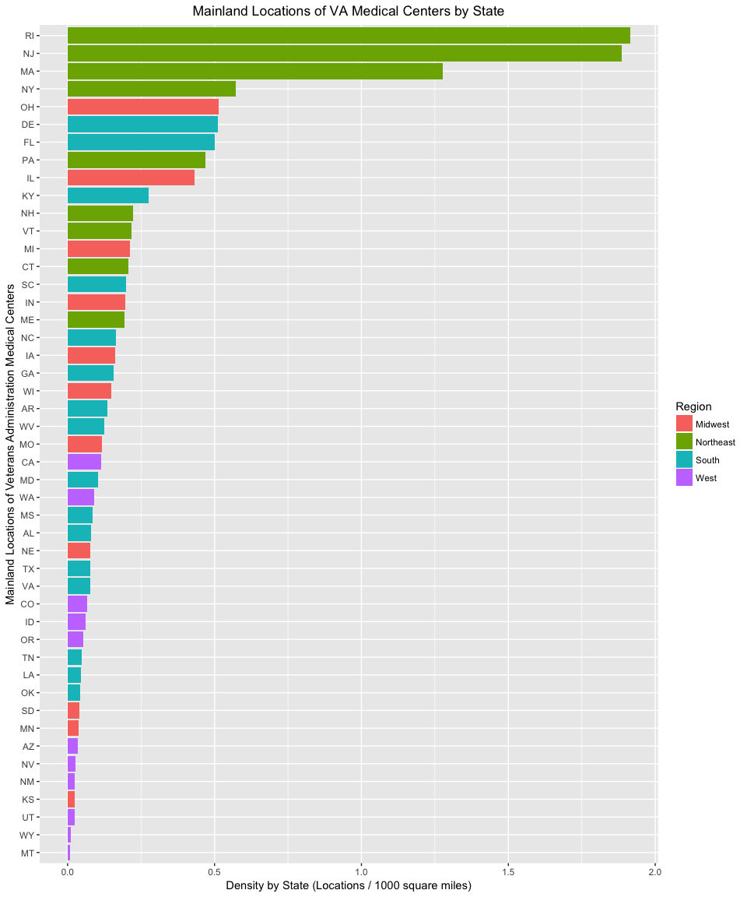

## Question 1: Mental Health Clinics

a) Downlaod file and load into environment
b) Create code which lists the State abrreviations.


```r
load(file = "Files/N-MHSS-2015-DS0001-data-r.rda")
mh2015_puf <- data.frame(mh2015_puf)

# Locate States
States <- unique(mh2015_puf$LST)

# Convert States into data frame
States <- data.frame(States)
head(States)
```

```
##   States
## 1 AL    
## 2 AK    
## 3 AZ    
## 4 AR    
## 5 CA    
## 6 CO
```

c) Filter the data.frame from 1A. We are only interested in the Veterans Administration (VA) medical centers in the mainland United States—create a listing of counts of these centers by state, including only mainland locations. Alaska, Hawaii, and U.S. territories should be omitted. DC, while not a state, is in the mainland, so it should remain included. Convert this to data.frame()


```r
# Make a list of Alaska, Hawaii, and US Territories
omitted <- c('AK','HI','VI','PR','PW','MP','MH','GU','FM','AS')

# grep to find the location of omitted items in this data
notmainland <- grep(paste(omitted,collapse = '|'),mh2015_puf$LST, value = FALSE)

# Create mainland data frame without omitted States/Territories
mainland <- mh2015_puf[-notmainland, ]

# Find the veterans administration locations in the mainland
VAmedical <- grep('[Vv]eterans', mainland$FACILITYTYPE, value = FALSE)

# Generate State and facility type
VA <- mainland[VAmedical,]
VA <- data.frame(VA$LST,VA$FACILITYTYPE)

# Use data.frame(table()) to get aggregated results by State
VA <- data.frame(table(VA$VA.LST))

# Remove zeros from VA
VA <- subset(VA,VA$Freq != 0)

# Adjust names of data frame
names(VA) <- c('States','Frequency')

VA <- VA[order(-VA$Frequency),]
row.names(VA) <- NULL
row.names(VA) <- 1:nrow(VA)

# Display
VA
```

```
##    States Frequency
## 1  FL            27
## 2  NY            27
## 3  IL            24
## 4  OH            21
## 5  PA            21
## 6  TX            20
## 7  CA            18
## 8  NJ            14
## 9  MI            12
## 10 KY            11
## 11 MA            10
## 12 GA             9
## 13 IA             9
## 14 MO             8
## 15 NC             8
## 16 WI             8
## 17 AR             7
## 18 CO             7
## 19 IN             7
## 20 ME             6
## 21 NE             6
## 22 SC             6
## 23 WA             6
## 24 ID             5
## 25 OR             5
## 26 AL             4
## 27 AZ             4
## 28 MS             4
## 29 MN             3
## 30 NM             3
## 31 NV             3
## 32 OK             3
## 33 SD             3
## 34 VA             3
## 35 WV             3
## 36 KS             2
## 37 LA             2
## 38 NH             2
## 39 RI             2
## 40 TN             2
## 41 UT             2
## 42 VT             2
## 43 CT             1
## 44 DC             1
## 45 DE             1
## 46 MD             1
## 47 MT             1
## 48 WY             1
```

d) Create a ggplot barchart of this filtered data set. Vary the bar’s colors by what State it has listed. Give it an appropriately professional title that is centered. Make sure you have informative axis labels. The State axis should be readable, not layered over each other. You’re welcome to have a legend or not.


```r
# ggplot
library(ggplot2) 
ggplot(data=VA, aes(reorder(States, Frequency),Frequency)) +
    geom_bar(stat="identity",aes(fill=States))+ 
    ggtitle('Mainland States of VA Medical Centers vs Frequency By State')+coord_flip()+
    xlab('Mainland States of Veterans Administration Medical Centers ')+
    ylab('Frequency')+
    theme(plot.title=element_text(hjust = .5)) +
    theme(axis.text.y = element_text(hjust=1))
```

<!-- -->

## Question 2: Cleaning and Bringing in New Features

a) This graph (1D) might be somewhat misleading, as bigger states may have more hospitals, but could be more sparsely located. Read statesize.csv into your R environment. This contains essentially a vector of square miles for each state. In trying to merge it with your data.frame() from 1C, you find that they don’t match. Use paste() on your LST column in 1C to see what the matter is, and write what you observe in a comment.

+ When merging statesize and Veterans Administration (VA) Medical Centers by the State a null frame will result.That is becase there are spaces in the LST column in the VA data set (State in the VA data frame created in 1C).  


```r
# Review State from statesize.csv
statesize <- read.csv(file = 'statesize.csv', header = TRUE)
attributes(statesize$Abbrev)
```

```
## $levels
##  [1] "AK" "AL" "AR" "AZ" "CA" "CO" "CT" "DE" "FL" "GA" "HI" "IA" "ID" "IL"
## [15] "IN" "KS" "KY" "LA" "MA" "MD" "ME" "MI" "MN" "MO" "MS" "MT" "NC" "ND"
## [29] "NE" "NH" "NJ" "NM" "NV" "NY" "OH" "OK" "OR" "PA" "RI" "SC" "SD" "TN"
## [43] "TX" "UT" "VA" "VT" "WA" "WI" "WV" "WY"
## 
## $class
## [1] "factor"
```

```r
# Review State from VA 
attributes(VA$State) #attributes(VAmedical$LST)
```

```
## $levels
##  [1] "AK    " "AL    " "AR    " "AS    " "AZ    " "CA    " "CO    "
##  [8] "CT    " "DC    " "DE    " "FL    " "GA    " "GU    " "HI    "
## [15] "IA    " "ID    " "IL    " "IN    " "KS    " "KY    " "LA    "
## [22] "MA    " "MD    " "ME    " "MI    " "MN    " "MO    " "MS    "
## [29] "MT    " "NC    " "ND    " "NE    " "NH    " "NJ    " "NM    "
## [36] "NV    " "NY    " "OH    " "OK    " "OR    " "PA    " "PR    "
## [43] "RI    " "SC    " "SD    " "TN    " "TX    " "UT    " "VA    "
## [50] "VI    " "VT    " "WA    " "WI    " "WV    " "WY    "
## 
## $class
## [1] "factor"
```

b) Correct the problem with the LST column using any method in R that is programmatic and easily understandable. Once you have made these state abbreviations identical to statesize.csv’s Abbrev column, merge the data.frame() from 1C and statesize.csv in order to add size information.

```r
# Remove spaces from State
VA$State = gsub(' ','',VA$State)

# Merge data frames by the State abbrev
state_merge <- merge(x= VA, y= statesize,by.x = 'State',by.y = 'Abbrev',all.x=TRUE)

# Remove duplicated column for State abbreviation
state_merge <- state_merge[,-2]

# Confirm data farmes retain row count
nrow(VA)
```

```
## [1] 48
```

```r
nrow(state_merge)
```

```
## [1] 48
```

```r
head(state_merge)
```

```
##   State Frequency   StateName SqMiles    Region
## 1    AL         4     Alabama   50750     South
## 2    AR         7    Arkansas   52075     South
## 3    AZ         4     Arizona  113642      West
## 4    CA        18  California  155973      West
## 5    CO         7    Colorado  103730      West
## 6    CT         1 Connecticut    4845 Northeast
```

c) Calculate a new variable in your combined data.frame() which indicates the VA hospitals per thousand square miles.

```r
state_merge$HospPerKMiles <- state_merge$Frequency/(state_merge$SqMiles/1000)
head(state_merge, 10)
```

```
##    State Frequency   StateName SqMiles    Region HospPerKMiles
## 1     AL         4     Alabama   50750     South    0.07881773
## 2     AR         7    Arkansas   52075     South    0.13442151
## 3     AZ         4     Arizona  113642      West    0.03519825
## 4     CA        18  California  155973      West    0.11540459
## 5     CO         7    Colorado  103730      West    0.06748289
## 6     CT         1 Connecticut    4845 Northeast    0.20639835
## 7     DC         1        <NA>      NA      <NA>            NA
## 8     DE         1    Delaware    1955     South    0.51150895
## 9     FL        27     Florida   53997     South    0.50002778
## 10    GA         9     Georgia   57919     South    0.15538942
```

d. Create another ggplot which considers the VAs per square thousand miles, rather than just frequency.


```r
# ggplot

# From 2c we know that data for DC is NULL
state_merge <- subset(state_merge,state_merge$State!='DC')

library(ggplot2) 
ggplot(data = state_merge, aes(reorder(State,HospPerKMiles),HospPerKMiles)) +
    geom_bar(stat="identity",aes(fill=Region)) + 
    ggtitle('Mainland Locations of VA Medical Centers by State')+coord_flip() +
    xlab('Mainland Locations of Veterans Administration Medical Centers') +
    ylab('Density by State (Centers/1000 sq. miles)')+
    theme(plot.title=element_text(hjust = .5)) +
    theme(axis.text.y = element_text(hjust=1))
```

<!-- -->

e) What patterns do you see? By this metric, is there any region that seems relatively high for VA medical centers per thousand square miles? How about low? Given these data, what advice might you give your boss before you start modeling (and why)?

It appears that many smaller States are now on top of the chart while many larger states are at the bottom of the chart. From this metric the Northeast appears to be relatively high while the West appears to be relatively low for VA Hospitals per 1000 square miles. Given this information I might recommend to my boss that a metric, such as VA Hospitals per 1000 square miles, is reviewed and the States with less density should be reviewed first. This data could be combined with a record of veterans eligible for VA Hospoital care to make a more information decision. 
